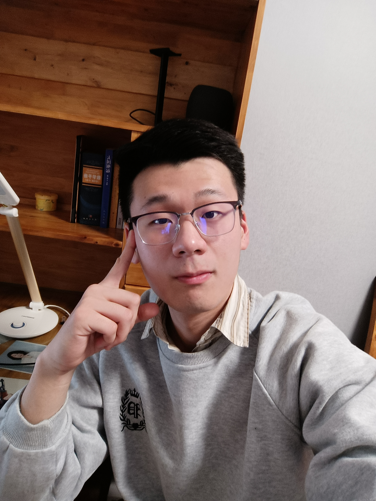

# Personal Background

 
* Academic qualifications: Bachelor degree
* Schools attended: Lanzhou University
* Major: Data Science
* Grade: Sophomore
* Email: songzch21@lzu.edu.cn

# Personal blog address

* Zhihu address: [https://www.zhihu.com/column/c_1608124867542220800](https://www.zhihu.com/column/c_1608124867542220800/)
* Kaggle address: [https://www.kaggle.com/sfstlt](https://www.kaggle.com/sfstlt/)

# Awards

## Mathematical Modeling competition

* CUMCM(First Prize)
* APMCM(Third Prize)
* Mathorcup(Second Prize)

## Kaggle (Solo)

* Novozymes Enzyme Stability Prediction (Top 10% Bronze Medal)
* OTTO – Multi-Objective Recommender System (Top 20%)

# Paper

* One ML Application paper is being revised (JCR Q2)
